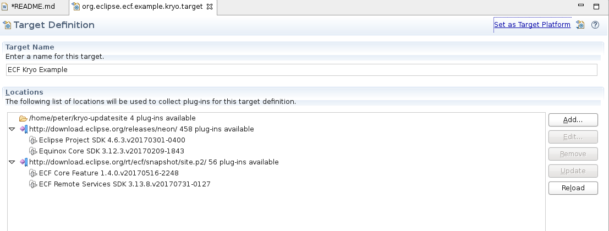

# Kryo serialization for Eclipse ECF

This is an additional serialization module for Eclipse ECF that uses the [Kryo framework](https://github.com/EsotericSoftware/kryo) to serialize and deserialize network messages used for remote invocation of OSGi Services.

An example demonstrating the setup and usage is provided.   

## Contents

- [Why](#why)
- [How](#how)
- [Setup and Usage](#setup-and-usage)
- [Known Issues](#known-issues)
- [License](#license)

## Why

Several [benchmarks](https://github.com/EsotericSoftware/kryo#benchmarks) show that serialization with Kryo has much better performance than default Java serialization.

## How

The bundle _org.eclipse.ecf.sharedobject.serializer.kryo_ provides a custom implementation of `ISharedObjectMessageSerializer` that can be used as dropin replacement to the default message serialization.

To use the custom `KryoSharedMessageSerializer` you need to register it on consumer and provider. See the coresponding example bundles for more details. 

## Setup and Usage 

### Target Platform preparation

In order to run the example you have to prepare a local directory which provides the necessary JAR files for Kryo and it's dependencies. This is needed because currently there is no P2 update site providing these artifacts for direct use.

* create a directory, e.g. /home/peter/kryo-updatesite
* download the following JAR files from maven central and put them that directory (click on "Download JAR"):
** https://mvnrepository.com/artifact/com.esotericsoftware/kryo/4.0.1
** https://mvnrepository.com/artifact/com.esotericsoftware/reflectasm/1.11.3
** https://mvnrepository.com/artifact/org.objenesis/objenesis/2.6
** https://mvnrepository.com/artifact/com.esotericsoftware/minlog/1.3.0

Note: for production use consider using a repository manager like [Eclipse Package Drone](https://packagedrone.org/) for storing and consuming external dependencies. 

### Running the Example

* clone this GitHub repository using Eclipse and import the projects into your workspace
* open the _org.eclipse.ecf.example.kryo.target_ project and edit the target file
* replace the directory location (eg. "/home/peter/...") with the directory location of your prepared target platform
* the target platform editor should list 4 plugins in that directory 

* click on "Set as Target Platform" in the upper right corner of the target platform editor
* start the "service consumer": in the_org.eclipse.ecf.example.kryo.consumer_ project double click on the _KryoExampleConsumer.generic.zeroconf.product_ file to open the product file editor
* click on the little play button on the upper right corner (ignore any errors saying something about  "org.eclipse.ecf.twitter.client")
* start the "service provider": in the_org.eclipse.ecf.example.kryo.provider_ project double click on the _KryoExampleProvider.generic.zeroconf.product_ file to open the Product file editor
* click on the little play button on the upper right corner (ignore any errors saying something with  "org.eclipse.ecf.twitter.client")

You should now see some debug output ("got value...") in the console view. Now look at the code ;) 

## Known issues

* currently the example is only working with the nightly build of ECF - after the next release i'll update the target platform definition (see [Bug 516074](https://bugs.eclipse.org/bugs/show_bug.cgi?id=516074)) 

## Thanks

Many thanks to the Eclipse [ecf-dev mailing list](https://dev.eclipse.org/mailman/listinfo/ecf-dev) for the friendly support, especially Scott Lewis.

## License

Licensed under the Eclipse Public License version 1.0, available at
http://www.eclipse.org/legal/epl-v10.html
